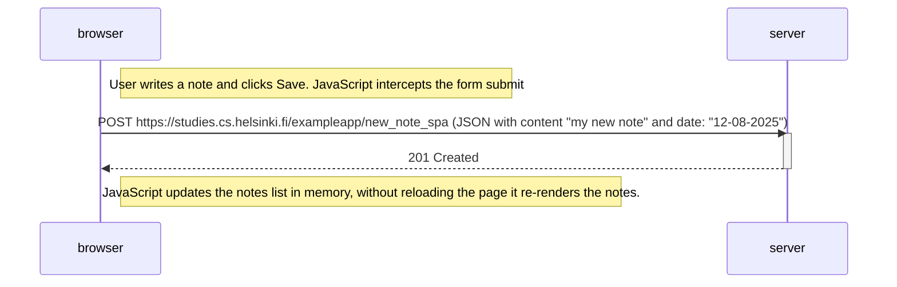

```mermaid
sequenceDiagram
    participant browser
    participant server

    Note right of browser: User writes a note and clicks Save. JavaScript intercepts the form submit

    browser->>server: POST https://studies.cs.helsinki.fi/exampleapp/new_note_spa (JSON with content "my new note" and date: "12-08-2025")
    activate server
    server-->>browser: 201 Created
    deactivate server

    Note right of browser: JavaScript updates the notes list in memory, without reloading the page it re-renders the notes.
```